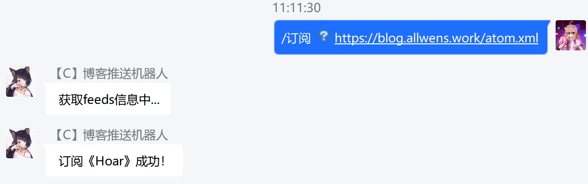

<h1 align="center">- BING BONG -</h1>
<p align="center">

</p>
<p align="center">A QQ(?) bot for rss subscription.</p>

## 介绍

bing-bong 是一个用于订阅 rss 的 QQ（？）机器人。理论上任何能够实现发送消息和监听事件的机器人框架都能够无缝接入它。

## 来源

这个项目主要来源自一个构想：**整合 Linux 社群友的博客**。

开始的想法是做一个社团主页，从大家的博客拉取文章并汇总，但由于大家博客的框架五花八门，很难有一个通用的方式获取博客文章。想到“通用”，就不自觉联想到了 RSS，各个博客平台一般都提供了 RSS 订阅，所以干脆做个 RSS 订阅机器人放在群里，实时检测博客更新并推送消息就好了！于是——这个项目产生了。

## 配置

首先需要执行`db.sql`初始化数据库，接着参考 config.yml 文件的内容修改配置并运行。

```yml
botType: qq # 机器人类型
qq:
  account: "123456" # QQ账号
  webSocket: "ws://127.0.0.1:6700/" #cq-http的正向ws地址
  accessToken: "123456" # cq-http的token
dbAddress: "localhost:3306" # 数据库链接（目前仅支持mysql）
dbUser: root # 数据库账号
dbPass: root # 数据库密码
dbName: bingbong # 数据库名
proxy: "" # 请求rss地址时使用的代理（例：http://localhost:7890，留空表示无代理）
checkTime: 5 # 检测rss订阅的时间间隔（单位分钟）
checkRange: 5 # 检测rss订阅的最大条数（程序会检测rss地址的前min(checkRange,len(feeds))条消息）
```

## 运行

前往[release 页面](https://github.com/amtoaer/bing-bong/releases)下载预编译版本（仅`linux_amd64`）或自己编译该程序，将程序文件与配置文件放置在相同目录下，即可运行启动。

以下是针对特定客户端的说明：

- QQ

  当今的 QQ 机器人框架往往按照[onebot](https://github.com/botuniverse/onebot)标准暴露应用接口，SDK 通过多种方式与其通信达到目标，本程序也不例外。想要运行该程序，首先需要运行一个 onebot 服务，如[go-cqhttp](https://github.com/Mrs4s/go-cqhttp)，具体说明请参考文档。

## 开发

对于机器人适配者，可在 client 下创建对应机器人，实现该接口：

```go
type robot interface {
	Init()
	SendMessage(int64, string, bool)
	HandleEvent(*message.MessageQueue)
}
```

关于机器人配置的注入方式，可参考 QQ 在`main.go` 中的实现。

对于其它开发者，可修改对应文件并提交 PR。

## 缺陷

这个项目只是我实习工作之余写的一个小工具，现在还有着不少缺陷（当然凑合用是够了 XD），目前已知的有：

1. 同一用户订阅多个 url 时会起多个协程监听消息，或许可以考虑合并。

2. 用户需要手动执行 db.sql 初始化数据库，可以考虑整合到程序中。

3. 数据库表的结构有些奇怪，重新设计可能会提高性能。

4. 当前数据库初始化方式不适合进行单测，将来也许要部分重构。
